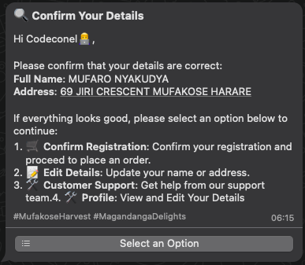
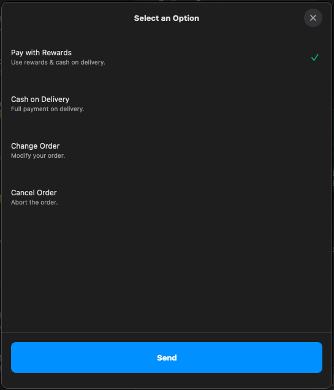

# **Musika Bot System Overview**

Welcome to **Musika Bot**—your WhatsApp-based marketplace for fruits and vegetables! This guide will walk you through the steps of using the system, from registration to placing and tracking orders. Let's get started!

---

## **Step 1: User Registration**

Before you can start using Musika, you need to register. Follow these steps to get set up:

1. **Send a message to Musika Bot**  
   Simply open WhatsApp and send a message saying "Hello" or any message to the Musika bot number. If it’s your first time interacting with the bot, you will receive the following message; otherwise, you go straight to the main menu.

2. **Provide your details**  
   Musika will ask for the following information:

   - Full Name
   - Address (for delivery purposes)

     _Screenshot Example:_

     
     

3. **Verification**  
   After providing your details, you will receive a confirmation message, prompting you to confirm your details.

   _Screenshots_

   

4. **Confirmation**  
   After verifying your details, you will receive a confirmation message welcoming you to Musika, and you can begin placing orders.

   **Note:** After you have successfully registered, a rewards account is automatically opened for you where the rewards in cash you earn when you buy using the platform are added.

   _Screenshot Example:_

   

---

## **Step 2: Main Menu Options**

Once registered, you can access the main menu. Here’s what you can do:

_Click the select option button, and the following menu displays._

1. **Place Order**

   

   Browse through a list of available fruits and vegetables, select the items you want, and confirm your order.

2. **Track Order**  
   

   Track your order in real-time. Simply choose the "Track Order" option to check the status of your delivery.

   _If you do not have any orders, this displays._
   _If your order has been received, it’s sent to packaging._
   _If your product has been packed, this displays._
   _If the products have been sent for delivery, this displays._

   

3. **Customer Support**  
   If you have any questions or issues, select the "Customer Support" option, and one of our agents will assist you.

   _Screenshot Example: (Insert a screenshot showing the customer support option)_

4. **Check User Profile**  
   You can view your profile, including your delivery address, and update any information if necessary.

   _Screenshot Example: (Insert a screenshot of the user profile view)_

---

## **Step 3: Placing an Order**

Let’s walk through the order process:

1. **Select “Place Order” from the menu**

   

   

   The bot will display available products with prices and quantity options.

   

2. **Choose your items**  
   Select the products you want, and specify the quantity.

   

   

   

3. **Confirm your order**  
   Once you’ve selected everything, the bot will display a summary of your order for confirmation. You then select the payment method thereby confirming your order. The calculated reward is attached to your order; if you make the purchase, you receive the equivalent cash reward which you can use to purchase more or choose to withdraw.  
   **Note:** You cannot purchase if your order is less than a dollar.

   - If the order total is less than a dollar.

   - If the order total is greater than a dollar.

   

   **Payment methods accepted**

   

   - Cash on delivery
   - Rewards balance
   - Rewards balance + cash on delivery for the remaining

   If you select Cash on Delivery, your order is confirmed and automatically sent to packaging.

   

   - If you have a sufficient rewards balance and choose to pay with rewards:

     - If you have sufficient balance:

     

     Your order is automatically confirmed, and the total order amount is deducted from your rewards account.

     

     - Else, if you have insufficient balance to pay the total order amount but it is greater than a dollar, you can choose to pay some using rewards and some using cash on delivery.

     

     Then you proceed to pay with both options or choose to pay the total amount with cash on delivery.

     

     The amount payable using rewards is automatically deducted, and the amount left reflecting is the amount to pay using cash on delivery.

      The order is confirmed.

     

     - Else, if you have insufficient balance and it is a dollar or less:

       

       Then you are only left with options:

       - Pay full cash on delivery
       - Change order
       - Cancel order

       

4. **Receive an order confirmation**  
   After confirming, you'll receive a success message, and your order will begin to be processed. Constant updates will be sent based on the status of your order: packed, sent for delivery, or delivered.

---

## **Step 4: Tracking Your Order**

Once your order is placed, you can track its status:

1. **Choose “Track Order”**  
   The bot will show your current order status: "Order Placed," "In Progress," or "Out for Delivery."

   

   

2. **Live updates**  
   You will receive updates as your order progresses towards delivery.

   

   

   _Screenshot Example: (Insert a screenshot of order tracking updates)_

---

## **Step 5: Editing User Profile**

Need to update your address or other details? Here’s how:

1. **Select “Check User Profile”**  
   The bot will display your current profile details.

2. **Choose “Edit”**  
   Select the option to edit your profile, update your address, or change your name.

3. **Save changes**  
   Confirm the changes, and you’re all set!

   _Screenshot Example: (Insert a screenshot of the edit profile process)_

---

## **Conclusion**

Musika Bot makes shopping for fresh fruits and vegetables easy and convenient—all through WhatsApp! Follow these simple steps, and you’ll have your produce delivered to your door in no time.

If you have any questions, don’t hesitate to reach out via the **Customer Support** option. Happy shopping!
